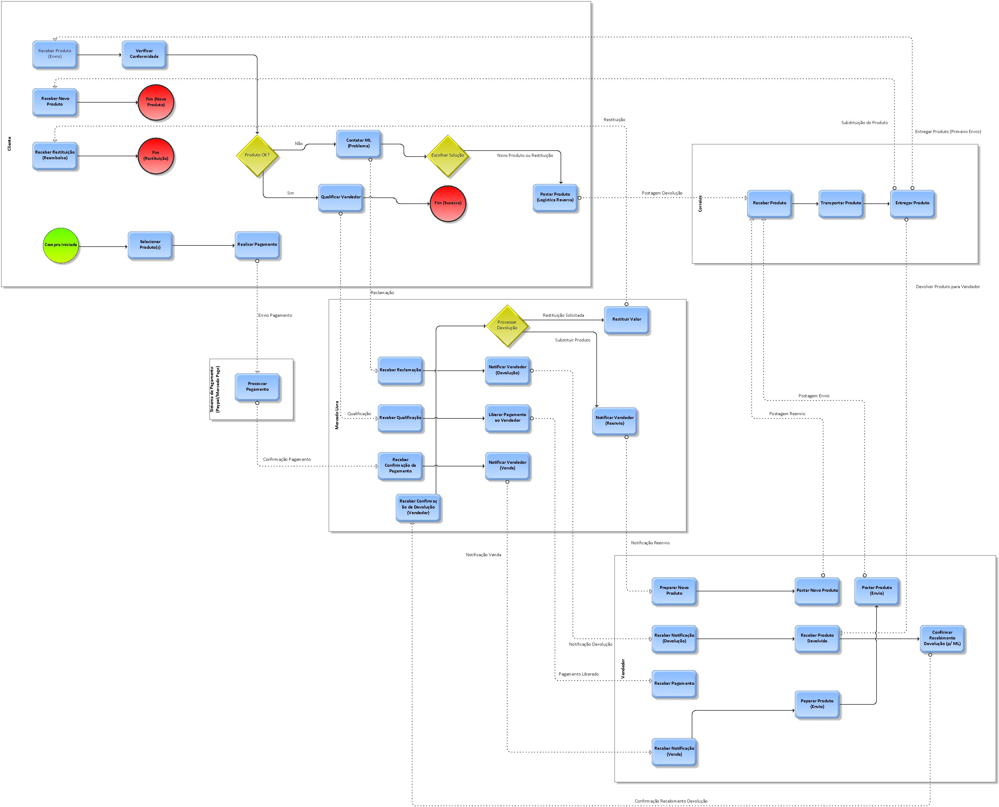

# Modelagem BPMN: Processo de Compra e Devolução no Mercado Livre

## Contexto

Este repositório contém um modelo de processo de negócio, elaborado como parte de uma atividade ponderada de negócios, "Questão de Negócios Parte 1 - Tarefa de modelagem de processos". O modelo utiliza a notação BPMN (Business Process Model and Notation) para representar visualmente o fluxo de compra e devolução numa plataforma de e-commerce, baseando-se no cenário descrito abaixo.

## Ferramenta de Modelagem

Para a criação deste modelo BPMN foi utilizado o software **ARIS Express**, uma ferramenta especializada para modelagem de processos de negócio que permite criar diagramas BPMN de forma estruturada e profissional.

## Descrição do Processo Base

O processo modelado parte da seguinte descrição:

> "Um cliente compra um ou mais produtos no site Mercado Livre. O pagamento é feito pelo cliente por meio das empresas Paypal ou Mercado Pago. O vendedor faz a postagem do produto, que é entregue pelos Correios. Assim que o cliente recebe o produto, verifica a conformidade. Se estiver tudo certo, ele qualifica positivamente o vendedor e o pagamento é liberado ao vendedor pelo Mercado Livre. Se houver algum problema com o produto, o cliente negocia com o vendedor ou devolve o produto. Neste caso, o valor pago deverá ser restituído ao cliente."

Posteriormente, o cenário foi refinado para detalhar o processo de negociação e devolução:

> Ao identificar um problema, o cliente contacta o Mercado Livre (mediador). O cliente então escolhe entre duas soluções: (1) Devolver o produto e receber o dinheiro de volta, ou (2) Devolver o produto e receber um novo produto igual. Ambas as opções exigem um processo de **Logística Reversa**, onde o cliente envia o produto de volta ao vendedor através dos Correios. Apenas após a confirmação do recebimento da devolução pelo vendedor (comunicada ao Mercado Livre), o Mercado Livre procede com a restituição do valor ou notifica o vendedor para enviar um novo produto.

## Objetivo da Modelagem

O objetivo principal deste modelo BPMN é fornecer uma representação clara, padronizada e compreensível do processo de compra e devolução descrito, destacando as interações entre os diferentes participantes e as decisões chave ao longo do fluxo.

## Diagrama

Figura 1 - Diagrama BPMN 
 
Fonte: Material produzido pelos autores (2025) 

## Notação Utilizada: BPMN

O diagrama utiliza a notação BPMN 2.0, um padrão global para modelagem de processos de negócio. Os principais elementos visíveis no diagrama são:

*   **Piscinas (Pools):** Representam os participantes principais e independentes do processo (Cliente, Mercado Livre, Vendedor, Sistema de Pagamento, Correios). Cada piscina contém as atividades realizadas por esse participante.
*   **Eventos (Events):** Círculos que marcam o início (verde), o fim (vermelho) ou ocorrências durante o processo.
*   **Atividades (Activities/Tasks):** Retângulos arredondados que representam trabalho realizado por um participante.
*   **Gateways:** Losangos que representam pontos de decisão (onde o fluxo se divide com base numa condição, ex: "Produto OK?") ou de convergência.
*   **Fluxos de Sequência (Sequence Flows):** Setas contínuas que mostram a ordem das atividades *dentro* de uma mesma piscina.
*   **Fluxos de Mensagem (Message Flows):** Setas tracejadas que mostram a comunicação e troca de informação *entre* diferentes piscinas.

## Participantes (Piscinas)

O processo envolve os seguintes participantes principais, representados como piscinas no diagrama:

1.  **Cliente:** Inicia a compra, realiza o pagamento, recebe o produto, verifica a conformidade, qualifica (no fluxo de sucesso) ou inicia o processo de reclamação/devolução.
2.  **Mercado Livre:** Plataforma que orquestra a transação. Recebe o pedido, confirma o pagamento, notifica o vendedor, recebe a qualificação, libera o pagamento (sucesso) ou medeia o processo de devolução/restituição/reenvio.
3.  **Vendedor:** Recebe a notificação de venda, prepara e posta o produto, recebe o pagamento (sucesso) ou recebe a notificação de devolução, recebe o produto devolvido, confirma o recebimento e, se aplicável, prepara e envia um novo produto.
4.  **Sistema de Pagamento:** Entidade externa (ex: Paypal, Mercado Pago) responsável por processar o pagamento e confirmar ao Mercado Livre.
5.  **Correios:** Entidade externa responsável pela logística de transporte e entrega, tanto no envio inicial quanto na logística reversa da devolução e no reenvio.

## Visão Geral do Fluxo

O diagrama representa dois caminhos principais:

1.  **Fluxo Principal ("Happy Path"):**
    *   O Cliente seleciona o produto e realiza o pagamento.
    *   O Sistema de Pagamento processa e confirma ao Mercado Livre.
    *   O Mercado Livre notifica o Vendedor.
    *   O Vendedor prepara e posta o produto via Correios.
    *   Os Correios entregam ao Cliente.
    *   O Cliente recebe, verifica e, estando tudo OK, qualifica o Vendedor via Mercado Livre.
    *   O Mercado Livre recebe a qualificação e libera o pagamento ao Vendedor.
    *   O processo termina com sucesso para todas as partes.

2.  **Fluxo de Problema e Logística Reversa:**
    *   Após receber o produto, o Cliente verifica e constata um problema.
    *   O Cliente contacta o Mercado Livre para reportar o problema.
    *   O Cliente, através da plataforma (ML), escolhe a solução desejada: Restituição ou Novo Produto (Gateway "Escolher Solução").
    *   **Logística Reversa (Comum a ambas as soluções):**
        *   O Mercado Livre notifica o Vendedor sobre a devolução iminente.
        *   O Cliente posta o produto problemático nos Correios para devolução ao Vendedor.
        *   Os Correios transportam e entregam o produto devolvido ao Vendedor.
        *   O Vendedor recebe o produto devolvido e confirma o recebimento ao Mercado Livre.
    *   **Resolução (Após confirmação da devolução):**
        *   O Mercado Livre processa a devolução (Gateway "Processar Devolução").
        *   **Se Restituição:** O Mercado Livre restitui o valor ao Cliente. O processo termina.
        *   **Se Novo Produto:** O Mercado Livre notifica o Vendedor para enviar um novo item. O Vendedor prepara e posta o novo produto via Correios. Os Correios entregam o novo produto ao Cliente. O processo termina.

## Considerações sobre o Diagrama

*   **Simplificações:** Para manter a clareza, algumas tarefas (especialmente nos Correios) foram representadas de forma mais genérica, com o contexto sendo dado pelas conexões de fluxo de mensagem.
*   **Compatibilidade Visual:** O layout foi criado utilizando o ARIS Express, que oferece recursos específicos para modelagem BPMN, permitindo uma representação clara e padronizada do processo.

## Conclusão

Este modelo BPMN oferece uma visão estruturada do processo de compra e devolução no Mercado Livre, detalhando as responsabilidades de cada participante e os fluxos de trabalho, incluindo o importante processo de logística reversa. Ele serve como uma ferramenta visual para análise e compreensão do processo de negócio em questão, cumprindo os requisitos estabelecidos para a "Questão de Negócios Parte 1 - Tarefa de modelagem de processos".